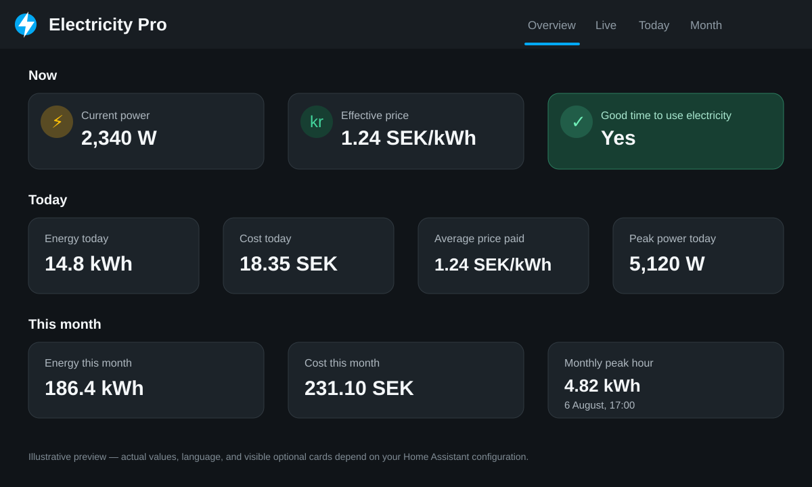
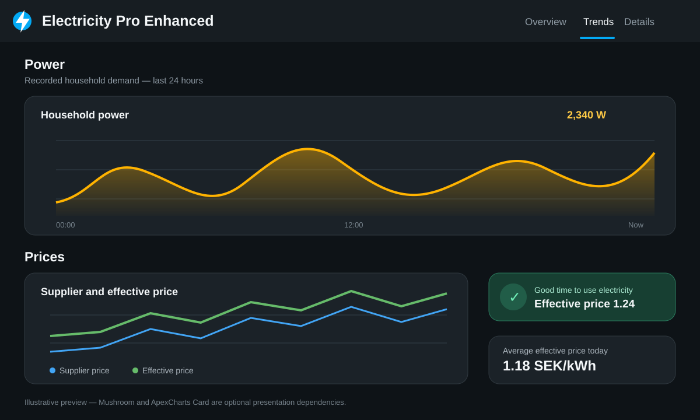

# Example dashboards

Electricity Pro includes a dependency-free standard dashboard and an optional
enhanced dashboard with richer presentation cards.

The enhanced dashboard never changes Electricity Pro calculations or entity
semantics. It is an optional presentation layer only.

## Standard dashboard

`electricity-pro.yaml` contains five views:

- **Overview** — the most important live, daily, and monthly values
- **Live** — current power, supplier price, Effective Price, and recent history
- **Today** — daily energy, cost, achieved average price, and peak power
- **Month** — monthly energy, cost, and peak-hour information
- **Forecast** — cheapest upcoming 1h, 2h and 3h windows, their average
  Effective Prices, next inexpensive hour, and near-term price direction

The Overview and Live views present Current Power, Effective Price, and Current
Cost Rate as green/yellow/red gauges. Their values are examples, not universal
limits:

- Current Power uses a 10,000 W scale, with yellow at 4,000 W and red at
  7,000 W.
- Effective Price uses a 0–3 scale in the price sensor's currency per kWh,
  with yellow at 1 and red at 1.5. Set the yellow boundary to the same value as
  the **Good price threshold** configured in Electricity Pro. These examples
  use 1.00 in the local currency per kWh.
- Current Cost Rate combines Current Power and Effective Price into the rate at
  which money is currently being spent. It uses a 0–20 scale in the price
  sensor's currency per hour, with yellow at 5 and red at 10.

Edit each gauge's `max` and `severity` values to suit the home's normal power
demand, local currency, electricity contract, and preferred price limits.

The preview is illustrative. Values, language, and visible optional cards depend
on the entities configured in your Home Assistant installation.

## Installation

These examples are stored in the GitHub repository for copying. HACS installs
the Electricity Pro integration but does not create or modify Home Assistant
dashboards.

1. In Home Assistant, open **Settings → Dashboards → Add dashboard**.
2. Open the new dashboard, select **Edit dashboard**, and take control when
   prompted.
3. Open the three-dot menu, select **Raw configuration editor**, and replace
   its contents with `electricity-pro.yaml`.
4. Save the configuration and exit edit mode.
5. Confirm that the entity IDs match your Electricity Pro entities.

Entity IDs may differ if Home Assistant assigned alternative names during
installation. Replace any entity IDs in the example when necessary.

## Requirements

The dashboard works best when all optional Electricity Pro source sensors have
been configured. Built-in conditional cards hide optional entities whose state
is `unknown` or `unavailable`. Home Assistant always shows conditional cards
while editing, so exit edit mode when verifying their visibility.

If Home Assistant assigned a different entity ID, replace that ID throughout
the YAML. Cards and complete views can be removed or reordered without changing
the integration.

## Card requirements

The example uses only built-in Home Assistant heading, grid, tile, conditional,
and history graph cards. No HACS frontend cards are required.

## Enhanced dashboard

`electricity-pro-enhanced.yaml` contains four views:

- **Overview** — insight, live values, and daily and monthly statistics
- **Trends** — recorded power and price history with richer charts
- **Details** — optional three-phase current and voltage measurements
- **Forecast** — Mushroom presentation of the v1.1 scheduling insights

### Required frontend dependencies

Install both optional dashboard packages through HACS before copying the
enhanced YAML:

1. [Mushroom](https://github.com/piitaya/lovelace-mushroom) — compact entity,
   title, and insight cards (`custom:mushroom-*`).
2. [ApexCharts Card](https://github.com/RomRider/apexcharts-card) — recorded
   power and price charts (`custom:apexcharts-card`).

HACS itself is not part of Electricity Pro. If either card is missing, Home
Assistant reports a custom element error; use the standard dashboard instead
until both dependencies are installed and their frontend resources are loaded.

### Enhanced dashboard installation

1. Install HACS according to the HACS documentation if it is not already
   available.
2. In HACS, open **Frontend**, find and install **Mushroom** and
   **ApexCharts Card**, then refresh the browser when prompted.
3. Create a new manual dashboard and open its raw configuration editor.
4. Replace its contents with `electricity-pro-enhanced.yaml` and save.
5. Exit edit mode and verify the **Overview**, **Trends**, and **Details**
   views.

The enhanced example displays recorded Electricity Pro entity history and the
forecast insights calculated by the integration. It does not create forecasts,
modify prices, or contain provider-specific calculations. Optional cards are
wrapped in built-in conditional cards and are hidden when their entities are
`unknown` or `unavailable`.

Its Overview view uses the same editable Current Power, Effective Price, and
Current Cost Rate gauges as the standard dashboard. These gauges use built-in
Home Assistant cards and do not add another frontend dependency.

The Details view presents Current L1, L2, and L3 as comparable gauges. The
example assumes a 20 A main fuse: green below 14 A, yellow from 14 A, and red
from 18 A. All three gauges deliberately use the same scale so phase imbalance
is easy to see. Change each gauge's `max` and `severity` values together if the
installation has a different main-fuse rating.

## Customization

For either dashboard, replace entity IDs if Home Assistant assigned different
names. You can remove cards for features you do not configure, adjust graph
spans and grouping intervals, or reorder views without changing Electricity
Pro itself.
